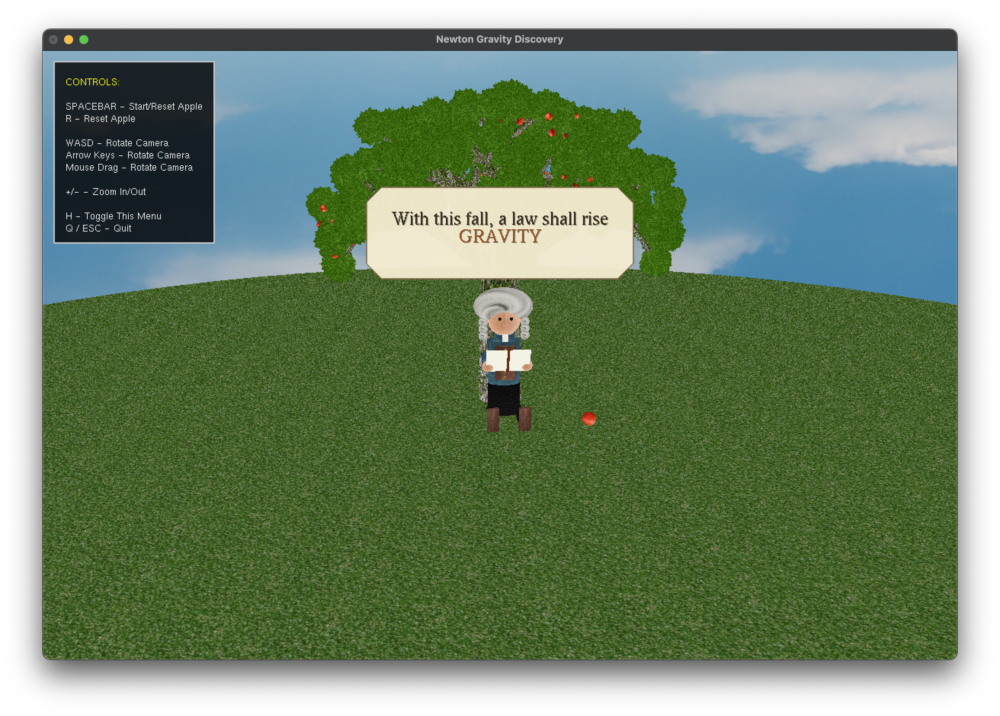

# Newton-Gravity

A 3D physics simulation inspired by Newton's legendary apple discovery, demonstrating the law of universal gravitation with interactive visualization using OpenGL.

## Overview

Newton-Gravity is a C++ application that recreates the famous moment of Newton's gravity discovery - watching an apple fall from a tree. This interactive 3D simulation features falling apples, trees, and environmental elements that demonstrate gravitational forces and physics principles in real-time, bringing the historic moment of scientific discovery to life.

## Features

- **Real-time 3D Physics Simulation**: Interactive gravity simulation with realistic physics
- **3D Rendered Environment**: Complete scene with trees, ground, sky, and atmospheric elements
- **Interactive Controls**: User-controlled camera and simulation parameters
- **Textured Objects**: Detailed textures for apples, trees, ground, and environmental elements
- **Menu System**: User interface for controlling simulation parameters
- **Message Display System**: On-screen information and feedback

## Project Structure

```
Newton-Gravity/
├── include/           # Header files
│   ├── apple.h        # Apple object definitions
│   ├── constants.h    # Physical constants and configuration
│   ├── controls.h     # User input handling
│   ├── environment.h  # Environment rendering
│   ├── imports.h      # Common includes
│   ├── menu.h         # Menu system
│   ├── message.h      # Message display
│   ├── newton.h       # Core physics engine
│   ├── primitives.h   # Basic geometric shapes
│   ├── TextureLoader.h # Texture management
│   └── tree.h         # Tree object definitions
├── src/               # Source files
│   ├── apple.cpp      # Apple physics and rendering
│   ├── controls.cpp   # Input handling implementation
│   ├── environment.cpp # Environment rendering
│   ├── main.cpp       # Application entry point
│   ├── menu.cpp       # Menu system implementation
│   ├── message.cpp    # Message display system
│   ├── newton.cpp     # Physics calculations
│   ├── primitives.cpp # Basic shape rendering
│   ├── TextureLoader.cpp # Texture loading utilities
│   └── tree.cpp       # Tree object implementation
├── textures/          # Texture assets
│   ├── apple.bmp      # Apple texture
│   ├── bark.bmp       # Tree bark texture
│   ├── grass.bmp      # Ground grass texture
│   ├── leaf.bmp       # Tree leaf texture
│   ├── sky.bmp        # Sky texture
│   └── ...            # Additional textures
└── CMakeLists.txt     # Build configuration
```

## Prerequisites

- **C++ Compiler**: Available through Xcode Command Line Tools
- **CMake**: Version 3.10 or higher
- **OpenGL**: Built into macOS
- **GLUT**: Built into macOS (deprecated but functional)
- **IDEs**: Xcode or CLion (both supported)

### macOS Setup
No additional dependencies needed! The project uses macOS built-in OpenGL and GLUT frameworks.

**For Xcode development**:
- Install Xcode from the App Store
- Ensure Command Line Tools are installed: `xcode-select --install`

**For CLion development**:
- Install CLion IDE
- CMake is typically bundled with CLion
- Alternatively install CMake via Homebrew: `brew install cmake`

## Building the Project

### Using CMake (Recommended)

1. **Clone the repository**:
   ```bash
   git clone https://github.com/durgeshgowdac/Newton-Gravity.git
   cd Newton-Gravity
   ```

2. **Create build directory**:
   ```bash
   mkdir build
   cd build
   ```

3. **Configure and build**:
   ```bash
   cmake ..
   make
   ```

4. **Run the application**:
   ```bash
   ./Newton-Gravity
   ```

### Using Xcode (macOS)

1. Open `Newton-Gravity.xcodeproj` in Xcode
2. Select the Newton-Gravity scheme
3. Build and run (⌘+R)

### Using CLion (Recommended for Cross-platform)

1. **Open project in CLion**:
   - Open `CMakeLists.txt` as project
   - CLion will automatically configure CMake

2. **Build and run**:
   - Click the Build button or use ⌘+F9
   - Run with ⌘+R or click the Run button

## Controls

### Apple Physics
- **SPACEBAR**: Start/Reset Apple
- **R**: Reset Apple

### Camera Navigation
- **WASD**: Rotate Camera
- **Arrow Keys**: Rotate Camera
- **Mouse Drag**: Rotate Camera
- **+/-**: Zoom In/Out

### Interface
- **H**: Toggle Help Menu
- **Q/ESC**: Quit Application

## Historical Context

This simulation pays homage to one of the most famous moments in scientific history. According to legend, Sir Isaac Newton was sitting under an apple tree in 1666 when he observed an apple falling to the ground. This simple observation led him to wonder why the apple fell straight down rather than sideways or upward, ultimately inspiring his groundbreaking theory of universal gravitation.

While the story of Newton's apple may be apocryphal, it represents the beauty of scientific discovery - how everyday observations can lead to profound understanding of the universe's fundamental laws.

The simulation implements Newton's law of universal gravitation:

```
F = G * (m1 * m2) / r²
```

Where:
- F is the gravitational force
- G is the gravitational constant
- m1, m2 are the masses of objects
- r is the distance between object centers

## Physics Implementation

- **Graphics API**: OpenGL with GLUT
- **Physics Engine**: Custom implementation of gravitational physics
- **Texture Format**: BMP files for cross-platform compatibility
- **Build System**: CMake for cross-platform building
- **Architecture**: Object-oriented design with modular components

## Contributing

1. Fork the repository
2. Create a feature branch (`git checkout -b feature/new-feature`)
3. Commit your changes (`git commit -am 'Add new feature'`)
4. Push to the branch (`git push origin feature/new-feature`)
5. Create a Pull Request

## License

This project is licensed under the MIT License - see the [LICENSE](LICENSE) file for details.

## Acknowledgments

- Isaac Newton for the fundamental physics principles
- OpenGL community for graphics programming resources
- Contributors and testers who helped improve the simulation

## Screenshots

<p align="center">
  
</p>

---

**Author**: Durgesh Gowda C  
**Project Link**: https://github.com/durgeshgowdac/Newton-Gravity
